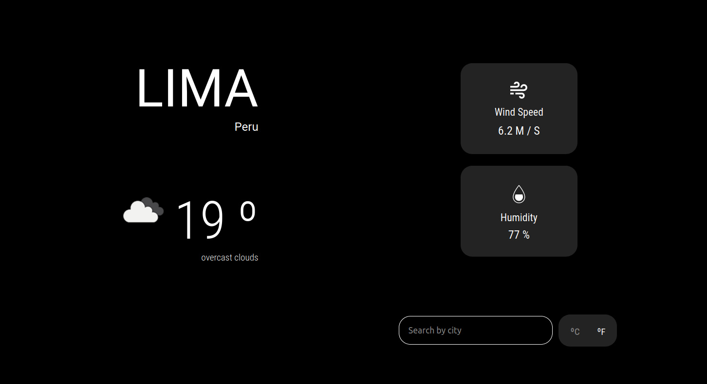

# Weather - JS App

> Javascript application using OOP principles, organizing JS code using object factories and classes along with ES6 modules, and using Webpack as a module manager. This app will use API from [Open Weather](https://openweathermap.org/) to search for a specific location(city) and toggle displaying the data in Fahrenheit or Celsius.

## Built With

- JS
- HTML
- SASS

## Tools

- Webpack
- npm

## NPM available scripts
Use "npm run-script " followed by any of the following commands : 

- "build": "webpack --mode production"
- "watch": "webpack --mode development --watch"

## Live Demo

[Live Demo Version](https://rawcdn.githack.com/bren2102/To-do-list/69460417a10f8b8390b213942a8b74115993204d/dist/index.html)

## Preview

## Authors

👤 **Brenda Yucra**

- Github: [@bren2102](https://github.com/bren2102) 
- Twitter: [@BrendaYucra2](https://twitter.com/BrendaYucra)
- Linkedin: [Brenda Yucra](https://www.linkedin.com/in/brenda-yucra-51980681/)

## 🤝 Contributing

Contributions, issues and feature requests are welcome!

Feel free to check the [issues page](https://github.com/bren2102/Weather-app/issues).

## Show your support

Give a ⭐️ if you like this project!
